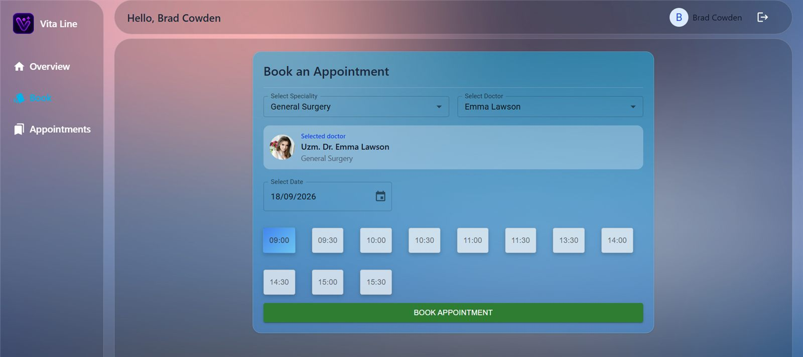
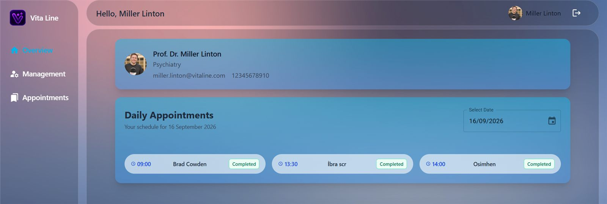
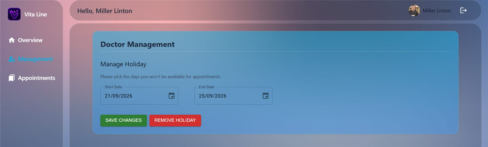
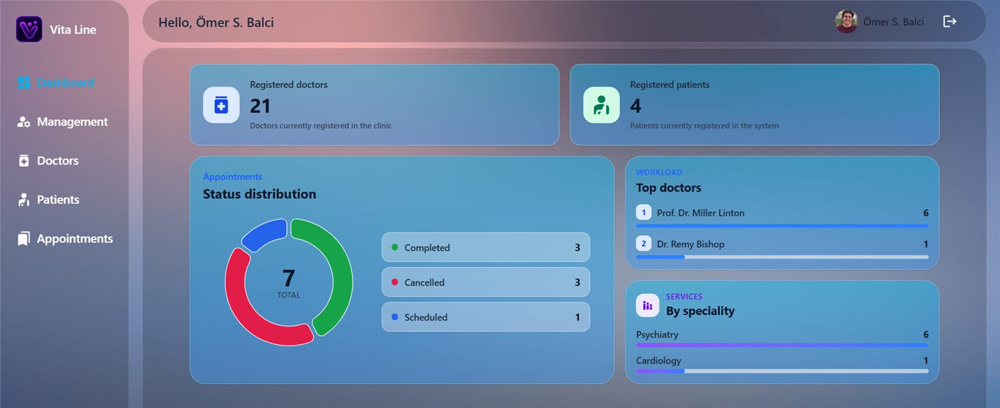
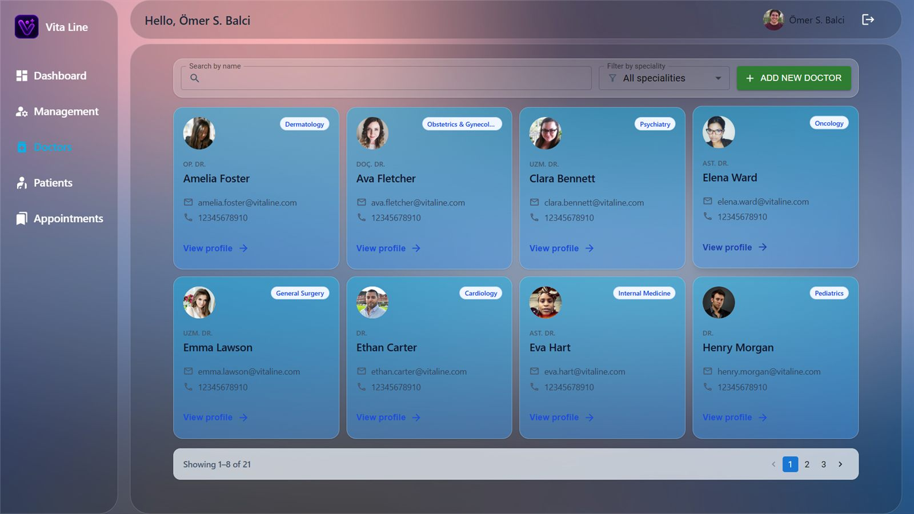
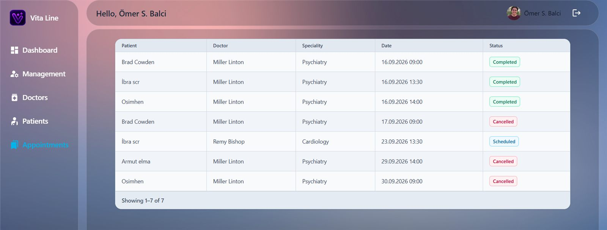
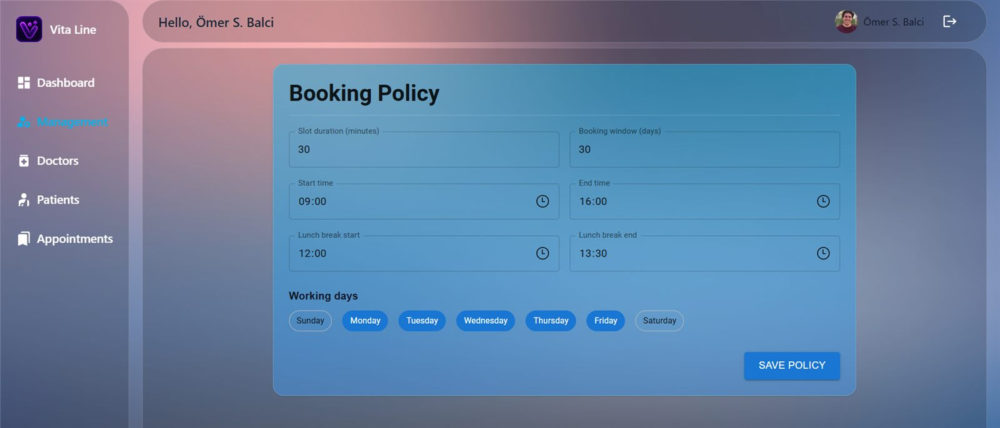

# VitaLine

VitaLine is a clinic appointment platform that brings patients, doctors, and clinic administrators into one simple workflow. Patients can find the right specialist and reserve an available time; doctors can follow their daily schedule; and administrators can manage the clinic from a single dashboard.

## Project status

VitaLine is a working full-stack project with separate patient, doctor, and administrator experiences. It was built primarily as a learning project to practice authentication, role-based access, appointment workflows, and service integration. For a production clinic system, a relational database could be a stronger fit for the many relationships and consistency requirements involved; MongoDB was selected here intentionally for learning, experimentation, and rapid iteration. The production deployment is intended for demonstrations and coursework, so use sample data rather than real patient information.

## Technical overview

### Frontend

- **Core:** React 19, TypeScript, Vite
- **Styling & UI components:** Material UI (MUI), Tailwind CSS, Styled Components
- **State management:** Redux Toolkit
- **Routing:** React Router
- **Data visualization and inputs:** MUI X-Charts, MUI Date Pickers
- **Form handling:** React Hook Form

### Backend

- **Core:** Node.js, TypeScript, Express.js
- **Database:** MongoDB, Mongoose
- **Authentication and security:** JSON Web Tokens (JWT), bcryptjs, role checks, API rate limiting
- **API documentation:** Swagger UI
- **Logging:** Structured JSON logs written to stdout/stderr and collected by Docker

## Project structure

- `/frontend` - React client, built as static files and served by Nginx.
- `/backend/api-gateway` - Public backend entry point.
- `/backend/auth-service` - Users, credentials, sessions, and admin startup.
- `/backend/patient-service` - Patient profiles.
- `/backend/doctor-service` - Doctor profiles and unavailable dates.
- `/backend/appointment-service` - Appointments, booking policy, and slot rules.

## What you can do

### Patients

- Create an account and sign in securely.
- Browse only the specialties and doctors currently available in the clinic.
- Choose a date and an open time slot, then book an appointment.
- Review appointment history and cancel appointments when needed.

### Doctors

- See a daily appointment overview with patient names, times, and statuses.
- Review the doctor profile and contact details.
- Set holiday or unavailable date ranges so patients cannot book those days.
- Manage the working schedule used to generate available time slots.

### Clinic administrators

- Monitor registered doctors, patients, and appointment activity from the dashboard.
- Search and filter the doctor directory by name or specialty.
- Add, edit, and manage doctor profiles.
- Review patients and appointments in one table.
- Configure booking rules such as slot duration, booking window, working days, and lunch breaks.

## Screenshots

The screenshots below show the main flows for each role. They use sample data only.

### Patient booking



### Doctor experience





### Administrator experience









## Try the application

The public application is available at [vitalineapp.com](https://vitalineapp.com/). Visitors can create a patient account and try the patient booking flow.

Doctor and administrator areas are protected by role-based access. Their screenshots demonstrate the management workflows without exposing privileged credentials.


## Getting started

### Prerequisites

- Docker Desktop with Docker Compose
- Node.js 24 when running or testing services outside Docker

### Installation

1. **Clone the repository:**

   ```bash
   git clone <repository-url>
   cd VitaLine
   ```

2. Create the ignored root `.env` from `.env.example` and replace the sample
   secrets and admin credentials.

### Environment configuration

Every executable component has a local `.env` and a Docker-specific
`.env.docker`. Real shared secrets stay in the ignored root `.env`; the
versioned Docker files contain only addresses, ports, and database names.

### Running the application

Docker Compose is the primary development runtime:

From the project root:

```bash
docker compose up -d --build
docker compose ps
```

For local commands, Compose automatically combines `docker-compose.yml` with
`docker-compose.override.yml`. The frontend is then available at
`http://localhost:8080`, and MongoDB is bound only to `127.0.0.1:27018`.
Application containers use `mongodb:27017` through the private Compose network.

Coolify must use `/docker-compose.yml` as its Compose location. It deploys only
the production-safe base file, so neither MongoDB nor the frontend publishes a
host port. Coolify's proxy reaches the frontend directly on container port 80.

## API documentation

The microservice API contract is exposed through the API Gateway. After the
Compose stack starts, open `http://localhost:8080/api-docs`.


## License

This project is licensed under the ISC License.
